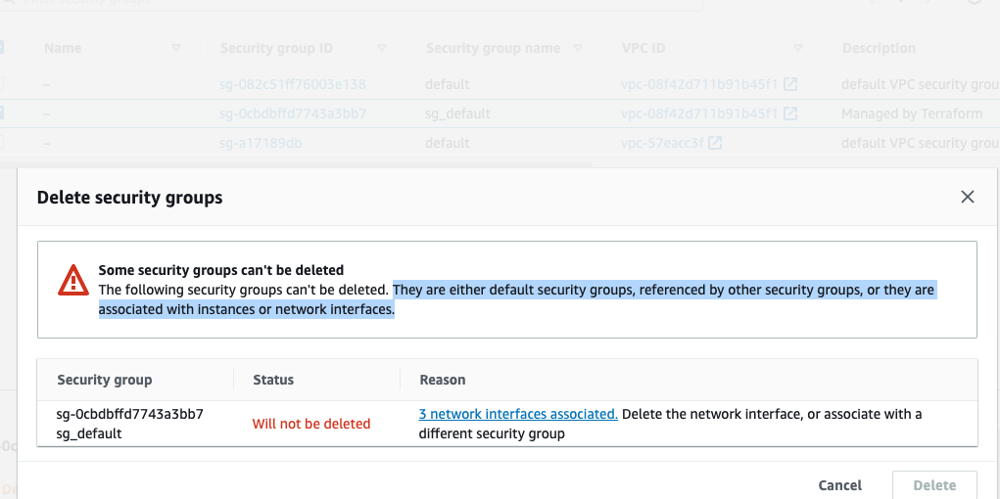
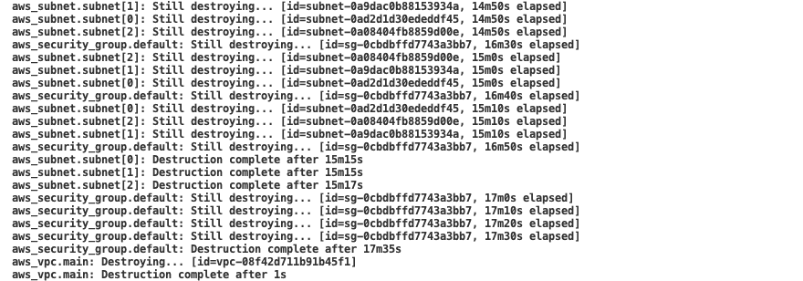

# Issue at 14 Aug, 2022 - Blocking during destroying security group

## Problem

- Can not destroy default security group because dependency with ENI linked with vpc_endpoint
- Blocking security group during Network Interface
  

## Resolution

- Manually delete ENI on console, then Subnets was deconstruction
- Delete ENI in EC2
  
