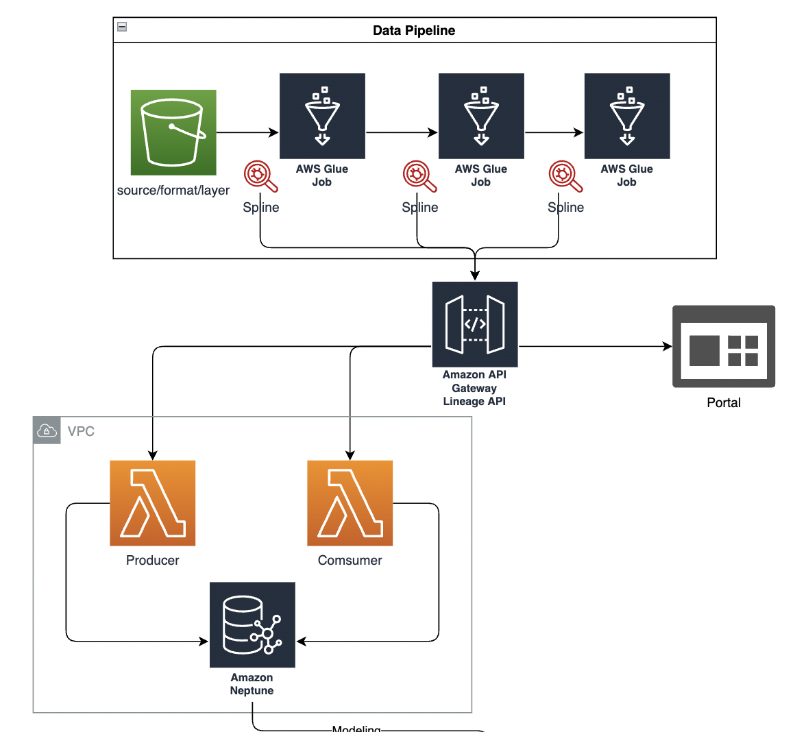
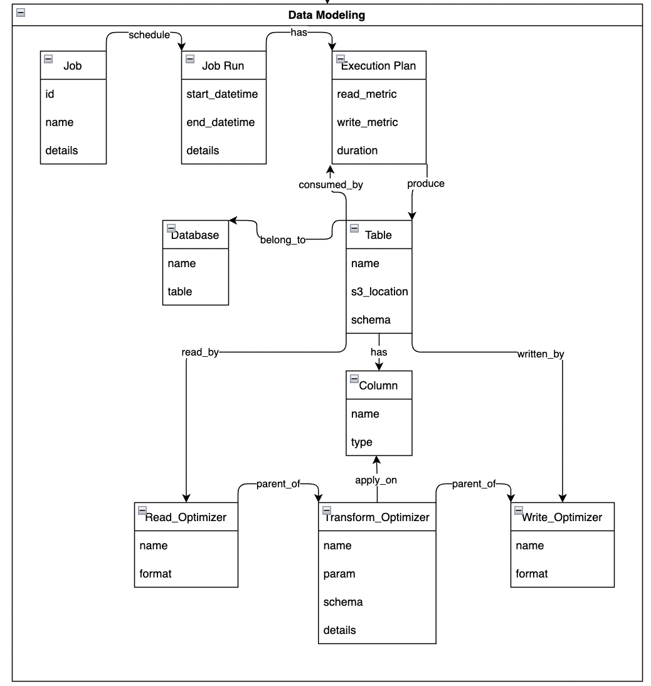
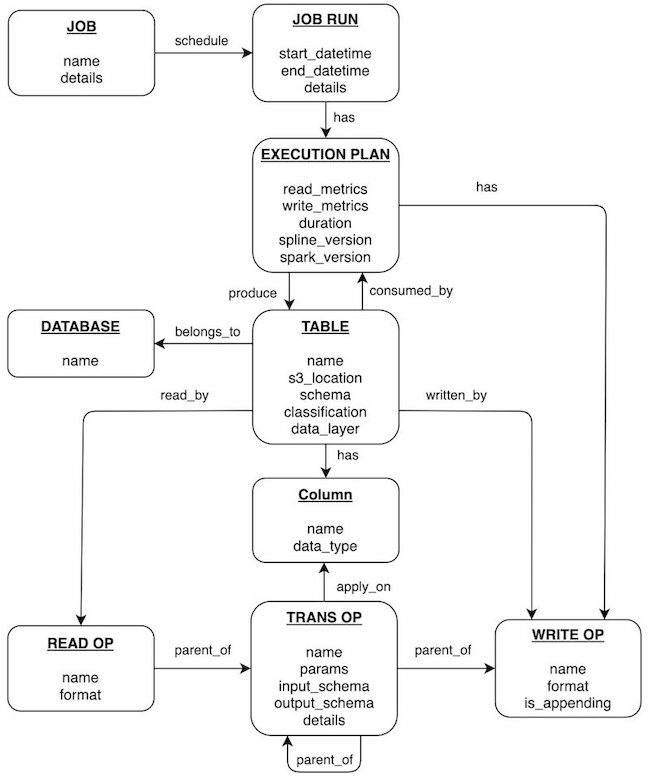

## Data Lineage for Data Lakes Example

This repository contains an example project for building Data Lineage for data lakes using AWS Glue, Amazon Neptune and Spline Agent.

Remarks: This setup works with AWS Glue Data Permissions Model and does not support Lake Formation Permission Model.

## Application Components in Spark

First, we need to understand joins in Spark

- Application: contains a main function
- Job: when Action performs on RDD, a "job" is created and submitted into Spark
- Stage: a job be divided into "stage" based on the shuffle boundary
- Task: a stage be further divided into "tasks" based on number of partition in the RDD. So then Tasks are the smallest unit of work for Spark

### Stack

- API: HTTP API powered by an API Gateway and lambda functions
- Frontend: Vue.js application
- Cloud services: AWS
- IaC: Terraform

### Architecture Design

Diagram shows architect and data model  
 


### Build & Deployment

To deploy the solution to AWS Cloud with terraform, export your AWS Credentials to terraform (AWS Profile or environment variables)

<!--  -->

### Data Modeling

Data Modeling for Spark Job and Dataset

<!--  -->

<<<<<<< Updated upstream

### MetaData Modeling
1. Data Flow


1. Lineage Data Model in Spark Job


  
=======
>>>>>>> Stashed changes
```
brew install terraform
git clone https://github.com/aws-samples/data-lineage-for-data-lake-example.git
cd data-lineage-for-data-lake-example

# download spline agent jar
wget https://repo1.maven.org/maven2/za/co/absa/spline/agent/spark/spark-3.1-spline-agent-bundle_2.12/0.6.1/spark-3.1-spline-agent-bundle_2.12-0.6.1.jar -O ./asset/lib/spark-3.1-spline-agent-bundle_2.12-0.6.1.jar

terraform init

terraform apply
```

To build and test the lineage visual application locally:

- update the lineage backend address in `src/lineage-visual/src/main.js`

```javascript
axios.defaults.baseURL =
  "https://xxx.execute-api.<aws-region>.amazonaws.com/dev";
```

```shell
cd src/lineage-visual
npm install
npm run serve
```

## Getting started

- Run the first Glue Job

```shell
aws glue start-job-run --job-name "RawToCurated_employee_optimize"
```

- Open the **lineage visual** application
- Run the second Glue Job

```shell
aws glue start-job-run --job-name "CuratedToAggregated_employee"
```

- Refresh the **lineage visual** application

## Security

See [CONTRIBUTING](CONTRIBUTING.md#security-issue-notifications) for more information.

## License

This library is licensed under the MIT-0 License. See the LICENSE file.
